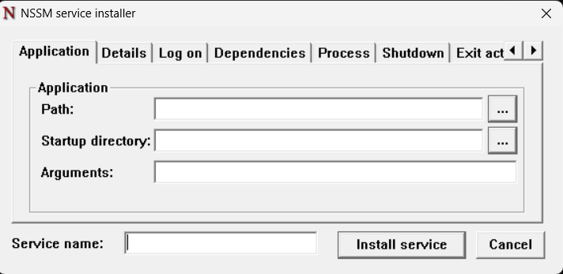

# GoodbyeDPI Service Installation

This guide will walk you through the steps to install GoodbyeDPI as a service on a Windows machine.

## Prerequisites

Before you begin, ensure you have the following prerequisites in place:

- [GoodbyeDPI](https://github.com/ValdikSS/GoodbyeDPI): Download the latest release from the official GitHub repository.

## Installation Steps

1. **Download GoodbyeDPI:**

   Visit the official [GoodbyeDPI GitHub repository](https://github.com/ValdikSS/GoodbyeDPI) and download the latest release. You can download it as a ZIP file.

2. **Extract GoodbyeDPI:**

   After downloading, extract the contents of the ZIP file to a location of your choice.

3. **Create a Folder in Program Files:**

   Navigate to your `Program Files` folder (usually located at `C:\Program Files`) and create a new folder named `goodbyedpi`. This is where you will place the GoodbyeDPI files.

4. **Copy GoodbyeDPI Files:**

   Inside the extracted GoodbyeDPI folder, you'll find two subfolders named `x86` and `x86_64`. Copy both of these folders and paste them into the `C:\Program Files\goodbyedpi` folder you created in the previous step.

5. **Create a goodbyedpi-service.cmd File in goodbyedpi folder in Program Files:**

   Now, create a new `goodbyedpi-service.cmd` file in a text editor of your choice. You can use Notepad or any code editor you prefer.

6. **Paste the Following Code into the .cmd File:**

   ```batch
   @ECHO OFF
   PUSHD "%~dp0"
   set _arch=x86
   IF "%PROCESSOR_ARCHITECTURE%"=="AMD64" (set _arch=x86_64)
   IF DEFINED PROCESSOR_ARCHITEW6432 (set _arch=x86_64)

   echo This script should be run with administrator privileges.
   echo Right click - run as administrator.
   echo Press any key if you're running it as administrator.
   pause
   sc stop "GoodbyeDPI"
   sc delete "GoodbyeDPI"
   sc create "GoodbyeDPI" binPath= "\"%CD%\%_arch%\goodbyedpi.exe\" -5 --dns-addr 77.88.8.8 --dns-port 1253 --dnsv6-addr 2a02:6b8::feed:0ff --dnsv6-port 1253z start= "auto"
   sc description "GoodbyeDPI" "Passive Deep Packet Inspection blocker and Active DPI circumvention utility"
   sc start "GoodbyeDPI"

   POPD

7. **Download NSSM:**

   Visit the [NSSM download page](https://nssm.cc/download) and download the NSSM (Non-Sucking Service Manager) executable suitable for your system. NSSM is a tool that allows you to manage Windows services.

8. **Extract NSSM:**

   After downloading NSSM, extract the contents of the downloaded ZIP file to a location of your choice.

9. **Create a Folder for NSSM:**

   Navigate to your `Program Files` folder (usually located at `C:\Program Files`) and create a new folder named `nssm`. This is where you will place the NSSM executable.

10. **Copy NSSM Executable:**

    Inside the extracted NSSM folder, you'll find a subfolder named `win64`. Copy the `nssm.exe` file from this folder and paste it into the `C:\Program Files\nssm` folder you created in the previous step.

11. **Edit Environment Variables:**

    - Open the Windows Start menu and search for "Environment Variables" or "Edit the system environment variables."

    - In the System Properties window, click the "Environment Variables" button.

    - Under the "System variables" section, locate the "Path" variable, select it, and click the "Edit" button.

    - In the Edit Environment Variable window, click the "New" button and add the path to the NSSM executable (`C:\Program Files\nssm`) to the list of paths. Click "OK" to save your changes.

12. **Open Windows Terminal:**

    Open the Windows Terminal or a command prompt with administrator privileges.

13. **Install GoodbyeDPI Service Using NSSM:**

    Type the following command to install the GoodbyeDPI service using NSSM:

    ```shell
    nssm install goodbyedpi
    ```

    This command will open a GUI window for configuring the service.

    

14. **Configure the Service:**

    In the NSSM GUI window:
    - Set the "Path" field to the location of the `.cmd` file you created earlier in the `C:\Program Files\goodbyedpi` folder.
    - Ensure that the "Startup directory" is set to the same folder where your `.cmd` file is located (`C:\Program Files\goodbyedpi`).
    - Click the "Install service" button.

15. **Service Installed:**

    The GoodbyeDPI service is now installed and configured to start automatically. You can start or stop the service using NSSM or standard Windows service management tools.

That's it! You've successfully installed and configured GoodbyeDPI as a Windows service using NSSM.

**Note:** Make sure to regularly update GoodbyeDPI and adjust the NSSM service configuration if needed. For more information on NSSM, refer to the [NSSM documentation](https://nssm.cc/usage).
